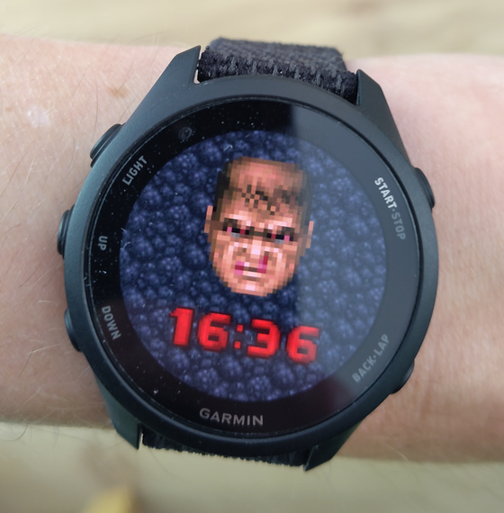

# DoomGuy Watchface

A **DOOM**-themed watch face for Garmin Forerunner devices. The classic DOOM status-bar face is the centerpiece — and it reacts to your **Body Battery** the way the marine's mug reacts to health in the game: stern and healthy when you're charged, bloodied and beaten when you're running low.



## Features

- **Body Battery = health.** The face cycles through the six classic DOOM mugshots based on your current Body Battery (100 → healthy, 0 → bloodied).
- **Real DOOM font.** The time is rendered with the actual DOOM numerals — extracted from the game's bitmap font and composited glyph-by-glyph — in DOOM red.
- **Crisp pixel art.** Sprites are scaled with nearest-neighbor filtering (`drawBitmap2` + `FILTER_MODE_POINT`) so everything stays sharp and blocky instead of blurred.
- **Low-battery reminder.** When the *device* battery drops to 20% or below, the percentage appears at the bottom in the DOOM font — time to charge.
- **Burn-in-safe always-on mode.** In low-power / always-on mode the face and background drop away, leaving just the time on black, nudged a few pixels each minute to protect AMOLED panels.

## Supported devices

AMOLED Forerunners with enhanced-graphics support:

> Forerunner **170**, **265**, **265S**, **570** (42 mm / 47 mm), **965**, **970**

Devices without runtime bitmap scaling (e.g. FR165, the FR255 family) and the MIP-display FR955 are intentionally not targeted — the pixel-art look relies on a full-color AMOLED display.

## Install (sideload a pre-built file)

Pre-built binaries aren't committed to the repo, so build one for your device first (see below), then:

1. Connect your watch to a computer via its USB cable.
2. Copy `DoomGuy.prg` into the **`GARMIN/Apps`** folder on the watch's storage.
3. Eject the watch, then select **DoomGuy** under **Settings → Appearance → Watch Face** (or hold the menu button on the current face).

## Build from source

Requires the [Connect IQ SDK](https://developer.garmin.com/connect-iq/sdk/) and your own developer key.

```bash
monkeyc -f monkey.jungle -o DoomGuy.prg -y /path/to/developer_key -d fr170
```

Swap `-d fr170` for another device id from the supported list to target a different model.

> **Note:** the signing key (`developer_key`) is intentionally **not** committed — it's a private key. Generate your own in the Connect IQ SDK / VS Code extension, or reuse an existing one.

## Project layout

```
manifest.xml            App metadata + target devices + permissions
monkey.jungle           Build configuration
source/                 Monkey C source (app + watch-face view)
resources/
  drawables/            Drawable + launcher-icon definitions
  sprites/              Doom face mugshots (0–100) + stone background
  font/                 Doom numerals extracted as glyph bitmaps
  layouts/  strings/    Layout + string resources
```

## Credits & disclaimer

DOOM, the DOOM guy, and the associated artwork and font are the property of **id Software**. This is a non-commercial fan project and is **not affiliated with or endorsed by** id Software, Bethesda, or ZeniMax. Face sprites and numerals are derived from DOOM assets and used here purely for a hobby watch face.
